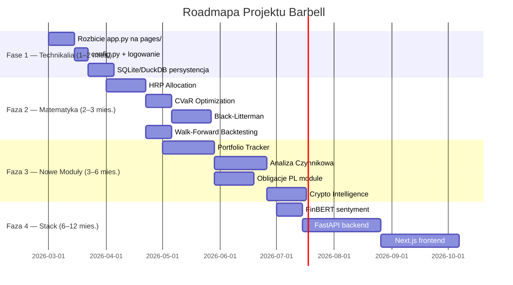

# 📊 Raport Analizy Projektu: Intelligent Barbell Strategy Simulator
**Data:** 2026-02-24 | **Autor:** Antigravity AI | **Wersja projektu:** v5.2

---

## 1. OBECNY STAN PROJEKTU — PRZEGLĄD

### Architektura

```
app.py (1695 linii — monolityczny plik główny)
└── modules/
    ├── simulation.py     — Monte Carlo, GARCH, t-Copula, Jump-Diffusion
    ├── scanner.py        — EVT/GPD, Hurst, Omega, Amihud, MST, HRP
    ├── stress_test.py    — Historyczne kryzysy, Reverse Stress Testing
    ├── emerytura.py      — Gompertz, CIR Inflation, SWR, FIRE
    ├── metrics.py        — Sharpe, Sortino, Calmar, VaR, CVaR, Omega, Ulcer
    ├── frontier.py       — Markowitz Efficient Frontier, Max Omega
    ├── analysis_content.py — Treści edukacyjne
    ├── styling.py        — CSS cyberpunk
    └── ai/
        ├── oracle.py         — Makro snapshot (YFinance + FRED + RSS)
        ├── agents.py         — LocalEconomist, LocalGeopolitics, LocalCIO
        ├── scanner_engine.py — Pipeline V5.2 (5 warstw)
        ├── screener.py       — Filtracja płynności
        ├── optimizer.py      — Genetyczny optymalizator (PyGAD)
        ├── observer.py       — Detekcja reżimów rynkowych
        ├── lstm_observer.py  — LSTM obserwator (szkielet)
        ├── architect.py      — Alokacja portfela
        ├── trader.py         — RL Trader (szkielet)
        ├── analysis_agent.py — Analiza wyników
        ├── asset_universe.py — Wszechświat aktywów
        └── data_loader.py    — Ładowanie danych
```

### Technologia (obecna)
| Warstwa | Technologia |
|---------|------------|
| UI | Streamlit (monolityczny `app.py`) |
| Dane rynkowe | yfinance, FRED (bez klucza) |
| NLP Sentyment | VADER (reguły leksykalne) |
| Monte Carlo | NumPy + Numba JIT + Sobol Sequences |
| Zmienność | ARCH (GARCH 1,1) |
| ML/AI | PyGAD (algorytm genetyczny), szkielet LSTM/RL |
| Wizualizacja | Plotly + Matplotlib |
| Podatki | 19% podatek Belki (zintegrowany) |

### Co projekt robi dobrze ✅
- Matematycznie rygorystyczny skaner aktywów (EVT/GPD, Hurst, AQR-style Z-Score)
- Realistyczna symulacja: GARCH(1,1) + t-Copula + Merton Jump-Diffusion
- Muliti-layer AI pipeline (Oracle → Economist → Geo → CIO → EVT)
- Belka Tax automatycznie w każdym obliczeniu
- Moduł emerytalny z rozkładem Gompertza i CIR inflation
- Historyczny stress test na 5 kryzysach
- Granica efektywna Markowitza z Omega ratio

---

## 2. CO UNOWOCZEŚNIĆ — ARCHITEKTURA TECHNICZNA

### 🔴 Krytyczne (zrób teraz)

#### ~~2.1 Rozbij monolityczny `app.py`~~
`app.py` ma **1695 linii** — to pułapka. Każdy nowy moduł go powiększa.

```
Nowa struktura:
app.py (~100 linii — tylko routing)
└── pages/
    ├── page_symulator.py
    ├── page_skaner.py
    ├── page_stress_test.py
    ├── page_emerytura.py
    └── page_[nowe moduły].py
```

Streamlit nativnie obsługuje `pages/` — Zero refaktoryzacji UI.

#### ~~2.2 Warstwa konfiguracji (config.py / settings.yaml)~~
Hardcodowane stałe rozrzucone po całym projekcie (np. `rf=0.0324`, `Belka=0.19`, `min_volume=500_000`). Powinny być w jednym miejscu:

```python
# config.py
TAX_BELKA = 0.19
RISK_FREE_RATE_PL = 0.0551  # WIBOR/TBSP
SCANNER_MIN_VOLUME = 500_000
```

#### ~~2.3 Obsługa błędów i logowanie~~
Brak centralnego loggera — `except Exception: pass` w wielu miejscach milcząco chowa błędy. Dodaj:
```python
import logging
logging.basicConfig(level=logging.INFO)
logger = logging.getLogger(__name__)
```

### 🟡 Ważne średnioterminowo

#### 2.4 Persystencja danych — baza danych
Obecnie wszystkie wyniki są w `st.session_state` — giną po odświeżeniu strony.
Rekomendacja: **SQLite** (lokalnie) lub **DuckDB** (analitycznie wydajny).

```python
# Przykład z DuckDB
import duckdb
conn = duckdb.connect("barbell_results.duckdb")
conn.execute("CREATE TABLE IF NOT EXISTS scan_results AS SELECT * FROM df")
```

#### ~~2.5 Asynchroniczne pobieranie danych~~
Oracle pobiera dane sekwencyjnie. Zamień na `asyncio` + `aiohttp`:

```python
async def fetch_all_tickers(tickers: list) -> dict:
    async with aiohttp.ClientSession() as session:
        tasks = [fetch_ticker(session, t) for t in tickers]
        return await asyncio.gather(*tasks)
```

Efekt: **5–10x szybszy skan** dzięki równoległości.

#### 2.6 Testy jednostkowe
Brak testów (`pytest`). Metryki matematyczne szczególnie potrzebują pokrycia testami:
```
tests/
├── test_metrics.py
├── test_scanner.py
├── test_simulation.py
└── test_emerytura.py
```

---

## 3. CO UNOWOCZEŚNIĆ — STOS TECHNOLOGICZNY

### 3.1 Zastąp Streamlit → FastAPI + Next.js (długoterminowo)
Streamlit jest świetny do prototypowania, ale ma ograniczenia:
- Brak prawdziwej wielostronicowości z parametrami URL
- Brak WebSocketów do real-time (tylko polling)
- Trudne customizacje UX

**Proponowany stack produkcyjny:**
```
Frontend: Next.js 15 (React) + Recharts / D3.js
Backend:  FastAPI (Python) + WebSockets
Cache:    Redis (dane rynkowe TTL=60s)
DB:       DuckDB (analityka) + PostgreSQL (użytkownicy)
```

### 3.2 Uaktualnij model AI — zastąp VADER
VADER to słownik z 2014 roku — słaby dla tekstów finansowych.

**Zamień na:**
- **FinBERT** (ProsusAI/finbert) — BERT pretrenowany na tekstach finansowych
- **lub** `distilroberta-financial-sentiment` — szybszy, równie dobry

```python
from transformers import pipeline
sentiment = pipeline("text-classification", model="ProsusAI/finbert")
score = sentiment("Fed hikes rates by 75bps, markets tumble")[0]
```

### 3.3 Dodaj PyTorch / TorchScript (aktywuj LSTM)
`lstm_observer.py` i `trader.py` to szkielety. Aktywuj z PyTorch:
- **TCN (Temporal Convolutional Network)** — lepszy od LSTM dla szeregów czasowych
- **Transformer-based** seq2seq dla prognozowania reżimów

### 3.4 Dodaj Polars zamiast Pandas (opcjonalnie)
Dla dużych skanów (>500 tickerów) Polars jest **10–50x szybszy**:
```python
import polars as pl
df = pl.from_pandas(pandas_df)  # Łatwa migracja
```

### 3.5 Dodaj Celery + Redis dla długich zadań
Skan V5.2 może trwać 2–5 minut. Przenieś do kolejki zadań:
```python
# tasks.py
@celery.task
def run_scan_async(horizon_years: int) -> dict:
    return ScannerEngine().run_v5_autonomous_scan(horizon_years)
```

---

## 4. CO UNOWOCZEŚNIĆ — MATEMATYKA I METODY ILOŚCIOWE

### 4.1 Granica Efektywna — zastąp Monte Carlo próbkowanie
Obecny `frontier.py` losowo próbkuje 3000 portfeli. To przestarzałe.

**Zamień na rygorystyczną optymalizację:**

#### A) HRP — Hierarchical Risk Parity (Lopez de Prado 2016)
Już masz dendrogram (`compute_hierarchical_dendrogram`). Dodaj alokację HRP:
```python
# Algorytm HRP: Bisection + Inverse Variance Weighting
def hrp_allocation(cov_matrix, linkage_matrix):
    # Recursive bisection
    ...
```

#### B) CVaR Optimization (Rockafellar & Uryasev 2000)
Zamiast minimalizować wariancję — minimalizuj CVaR₉₅ (ogon strat):
```python
from scipy.optimize import minimize
def minimize_cvar(weights, returns, alpha=0.05):
    port_returns = returns @ weights
    var = np.percentile(port_returns, alpha * 100)
    cvar = -np.mean(port_returns[port_returns <= var])
    return cvar
```

#### C) Black-Litterman Model
Połącz prior rynkowy (CAPM) z widokami CIO:
```
π = δ × Σ × w_market   (prior równowagi)
E[r] = [(τΣ)⁻¹ + P'Ω⁻¹P]⁻¹ × [(τΣ)⁻¹π + P'Ω⁻¹Q]
```
Widoki CIO (z `agents.py`) stają się wejściem `Q, P, Ω`.

### 4.2 Ulepsz model symulacji

#### A) Rough Volatility (Gatheral et al. 2018)
GARCH zakłada płynną zmienność. Rough Heston (fBM H≈0.1) lepiej pasuje do danych:
```python
# Rough Bergomi
xi = lambda t: xi0 * np.exp(2 * H * np.log(t))  # power-law decay
```

#### B) Reżimowy Model Markova (HMM) zamiast prostego risk_on/risk_off
Obecne 2 reżimy (risk_on/risk_off) to uproszczenie. Zastąp HMM z 3–4 stanami:
```python
from hmmlearn import hmm
model = hmm.GaussianHMM(n_components=4, covariance_type="full")
model.fit(returns_matrix)
regimes = model.predict(returns_matrix)
# Stany: Bull Quiet / Bull Volatile / Bear / Crisis
```

#### C) Factor Models — Fama-French 5-Factor
Dodaj dekompozycję alfa/bety na 5 czynnikach FF:
- Market (Rm-Rf), SMB, HML, RMW, CMA

#### D) Copula — rozszerz o Clayton/Gumbel
Obecna t-Copula jest dobra. Dodaj Archimedejskie kopule do lepszego modelowania asymetrycznej zależności ogonów:
- **Clayton**: dolna zależność ogonów (kryzysy gdzie wszystko spada razem)
- **Gumbel**: górna zależność (boom)
- **Frank**: symetryczna

### 4.3 Metryki — dodaj brakujące

| Metryka | Formuła | Po co |
|---------|---------|-------|
| **Sterling Ratio** | CAGR / avg drawdown depth | Lepsza od Calmar |
| **Burke Ratio** | Excess return / sqrt(sum DD²) | Penalizuje wiele DD |
| **Rachev Ratio** | ETL_gain / ETL_loss | Asymetria ogonów (Barbell idealne) |
| **Probabilistic Sharpe** | P(SR > SR_benchmark) | Bailey & de Prado 2012 |
| **Deflated Sharpe** | Sharpe / f(multiple testing) | Korekta na p-hacking |
| **Marginal CVaR** | ∂CVaR/∂w_i | Wkład każdego aktywa w ryzyko ogona |
| **TCI (Tail Correlation Index)** | Korelacja kondycjonalna w ogonach | Dla t-Copula |

### 4.4 Backtesting — Walk-Forward Validation
Obecny backtest jest jednorazowy. Dodaj properny **Walk-Forward**:
```
[Train 2y][Test 6M] → [Train 2y][Test 6M] → ...
```
Plus **Bootstrap Confidence Intervals** dla metryk.

---

## 5. CO UNOWOCZEŚNIĆ — ANALIZA FINANSOWA

### ~~5.1 Wskaźniki makro — rozszerz Oracle~~

Obecny Oracle ma ~10 wskaźników. Dodaj:

| Wskaźnik | Źródło | Logika Barbella |
|----------|--------|-----------------|
| **MOVE Index** | CBOE | Zmienność obligacji → Safe Sleeve ryzyka |
| **TED Spread** | FRED | Ryzyko kredytowe bankowe → reżim |
| **High Yield Spread (HY-IG)** | FRED | Apetyt na ryzyko korporacyjne |
| **Baltic Dry Index** | Investing.com | Globalny handel, ryzyko recesji |
| **AAII Sentiment Survey** | aaii.com | Contrarian indicator |
| **Insider Buying/Selling** | SEC EDGAR | Smart money flow |
| **Global M2 Growth** | Fed, ECB, PBoC | Płynność monetarna |
| **Crypto Fear & Greed** | alternative.me | Dla Crypto Risky Sleeve |

### 5.2 Podatki — rozszerz model podatkowy PL

Obecny model: tylko 19% Belki. Brakuje:
- **IKE/IKZE** — zwolnienie z Belki (limit IKE 2026 ≈ 26 019 PLN)
- **PPK** — dopłaty pracodawcy + państwa (1,5% + 0,25%)
- **Podatek od dywidend zagranicznych** (różne stawki per kraj)
- **Optymalizacja podatkowa** — tax-loss harvesting

### ~~5.3 Koszty transakcyjne — model realistyczny~~
Obecny backtest pomija koszty. Dodaj:
```python
TRANSACTION_COSTS = {
    "equity_pl":    0.0019,   # 0.19% DM
    "etf":          0.0005,   # 0.05% ETF broker
    "crypto":       0.0060,   # 0.60% crypto exchange
    "bonds":        0.0000,   # 0% Treasury Direct
    "bid_ask":      0.0002,   # implied spread
}
spread_cost = price * TRANSACTION_COSTS[asset_class] * 2  # buy + sell
```

### 5.4 Zarządzanie ryzykiem portfela — position sizing

Dodaj zaawansowane position sizing:
- **Fractional Kelly** (już jest częściowo) — ale dodaj Kelly w oparciu o EMPIRYCZNE momenty, nie normalne
- **Risk Budgeting** — max X% CVaR per aktywo
- **Volatility Targeting** — skaluj pozycję by utrzymać stałe Vol portfela (np. 15%/rok)
- **Stop-Loss + Trailing Stop** w backteście

---

## 6. CO UNOWOCZEŚNIĆ — FUNKCJONALNOŚĆ UI/UX

### 6.1 Dashboard / Landing Page
Brak widoku summary. Dodaj ekran główny z:
- Portfolio health score (0–100)
- Aktualny reżim CIO (Risk-On/Off)
- Ostatni skan — top 3 picks
- Miniaturki equity curves

### 6.2 Porównywarka portfeli
Możliwość porównania 2–4 strategii Barbell obok siebie:
- Side-by-side equity curves
- Tabela metryk diff (Twoja vs. Benchmark vs. 60/40)
- Winner/Loser heat map

### 6.3 Eksport danych
- **PDF/HTML report** — jeden klik, profesjonalny raport
- **Excel export** — tabele wyników
- **JSON/CSV** — dla dalszej analizy

### 6.4 Powiadomienia i Alerty
- Alert gdy CIO zmieni reżim (risk_on → risk_off)
- Alert gdy skaner znajdzie nowy top pick > threshold
- Email/Webpush (przez ntfy.sh lub email SMTP)

### 6.5 Ulepszenia w każdym module

#### Symulator
- Suwak czasu animowany (pokaż jak rozkład majątku ewoluuje)
- Porównanie z benchmarkami (S&P500, 60/40, WIG20)
- Scenario Builder — ręczne definiowanie kryzysów przyszłości

#### Skaner
- Filtrowanie po sektorze/regionie/klasie aktywów
- Watchlist — obserwuj konkretne tickery
- Historia skanów — jak zmieniał się Barbell Score w czasie

#### Stress Test
- Dodaj kryzysy: Stagflacja 1973, Krach 1987 (Black Monday), Kryzys długu EM 1998, Dot-com 2000
- Niestandardowy scenariusz — użytkownik definiuje własny szok
- Stress test portfela wynikowego skanera (auto-connect)

#### Emerytura
- Optymalizacja czasu FIRE — "ile lat pracy by osiągnąć FIRE?"
- Renta vs. portfel — porównanie annuity vs. SWR
- Sekwencja ryzyka — animate jak first-year crash niszczy FIRE plan
- Multi-currency (PLN vs. EUR vs. USD portfel emerytalny)

---

## 7. NOWE MODUŁY DO DODANIA

### 📦 Moduł 1: Watchlist & Portfolio Tracker (Priorytet: WYSOKI)
Real-time śledzenie portfela z alertami.

```
Funkcje:
- Manualne dodanie pozycji (ticker, ilość, cena zakupu)
- Auto-przeliczenie obecnej wartości (yfinance live)
- P&L per pozycja + total
- Automatyczne powiadomienie o rebalansowaniu
- Wycena portfela z uwzględnieniem podatku Belki
- Barbell Compliance Score — czy portfel jest zgodny ze strategią?
```

### 📦 Moduł 2: Analiza Czynnikowa (Factor Analysis) (Priorytet: WYSOKI)
```
Funkcje:
- Fama-French 5 Factor Decomposition
- Ekspozycja portfela na czynniki (Value, Size, Profitability, Investment, Market)
- Factor attribution — które czynniki generują Alfę?
- Style Box (jak Morningstar, ale oparty na FF)
- Porównanie: Barbell vs. Faktor neutralny
```

### 📦 Moduł 3: Analiza Fundamentalna (Priorytet: ŚREDNI)
Integracja z danymi fundamentalnymi (P/E, P/B, ROE, debt/equity):
```
Źródła: yfinance.info, Financial Modeling Prep (free tier), Macrotrends
Funkcje:
- Screener fundamentalny obok EVT Skanera
- Graham Number kalkulator
- DCF Valuation (uproszczony, parametryczny)
- Piotroski F-Score
- Altman Z-Score (ryzyko bankructwa)
```

### 📦 Moduł 4: Crypto Intelligence Dashboard (Priorytet: ŚREDNI)
Krypto jest kluczowym składnikiem Risky Sleeve:
```
Funkcje:
- On-chain metryki: NVT Ratio, MVRV Z-Score, Puell Multiple
- Bitcoin Rainbow Chart (historyczny)
- Crypto dominance cycles
- DeFi yield farming jako alternatywa dla Safe Sleeve?
- Halving cycle analysis
- Korelacja krypto ↔ akcje (zmienia się w kryzysach!)
```

### 📦 Moduł 5: Obligacje — Analiza Krzywej Rentowności (Priorytet: WYSOKI dla PL)
Safe Sleeve w projekcie to głównie obligacje. Brakuje:
```
Funkcje:
- Pełna krzywa rentowności PL + US + DE
- Duration / Modified Duration / DV01
- Analiza spreadu PL-DE (ryzyko polityczne)
- Kalkulator TOS / ROD / EDO (polskie obligacje detaliczne)
- Symulacja portfela obligacji przy różnych scenariuszach stóp
- Breakeven inflation dla obligacji indeksowanych
```

### 📦 Moduł 6: Risk Parity Portfolio Constructor (Priorytet: ŚREDNI)
Na wzór Bridgewater All Weather:
```
Algorytm:
1. Oblicz oczekiwane ryzyko każdej klasy aktywów
2. Alokuj kapitał tak by każdy aktyw wnosił równe ryzyko
3. Użyj dźwigni finansowej na Safe Sleeve (obligacje) by dorównać ryzykiem
Implementacja: Scipy optimize + risk_contribution funkcja
```

### 📦 Moduł 7: Analizy Historyczne Barbella (Priorytet: NISKI)
"Barbell przez historię":
```
Funkcje:
- Jak Barbell 90/10 radziłby sobie w każdej dekadzie od 1920?
- Najlepszy Barbell per era (lat 70. stagflacja, lat 80. bull market, lat 90. tech, 2000. krach)
- Historyczny dobór aktywów Risky Sleeve per epoka
- Rolling out-of-sample performance
```

### 📦 Moduł 8: AI Asystent (Agent RAG) (Priorytet: NISKI-ŚREDNI)
Lokalny LLM (Ollama + Mistral/Llama3) jako asystent finansowy:
```
Bez zewnętrznych API, pełna prywatność:
- "Wyjaśnij mi mojego Barbell Score"
- "Co zmienić w portfelu przy inwersji krzywej?"
- Semantyczne pytania o wyniki symulacji
- Generowanie narracji do raportów
```

---

## 8. ROADMAPA PRIORYTETOWA



### Priorytety Quick Wins (do 2 tygodni)

| # | Zmiana | Wysiłek | Wpływ |
|---|--------|---------|-------|
| 1 | ~~`config.py` z wszystkimi stałymi~~ | 2h | 🟢 Mały / czystość |
| 2 | ~~Rozbicie `app.py` na `pages/`~~ | 4h | 🔴 Duży / utrzymanie |
| 3 | ~~Dodaj 5 nowych wskaźników Oracle (MOVE, TED, HY)~~ | 4h | 🔴 Duży / skan accuracy |
| 4 | ~~Koszty transakcyjne w backteście~~ | 3h | 🔴 Duży / realizm |
| 5 | PDF/CSV export wyników | 3h | 🟡 Średni / UX |
| 6 | Moduł Obligacje PL (TOS/ROD/EDO) | 8h | 🔴 Duży / relevance PL |
| 7 | IKE/IKZE uwzględnienie w Emerytura | 4h | 🔴 Duży / PL specyfika |
| 8 | Walk-Forward Backtesting | 6h | 🔴 Duży / naukowy rygor |

---

## 9. OCENA OBECNEGO KODU (Scorecard)

| Wymiar | Ocena | Uzasadnienie |
|--------|-------|--------------|
| **Matematyczna rygorystyczność** | 8.5/10 | EVT, t-Copula, GARCH, Hurst — top level; brak HRP, CVaR opt |
| **Architektura kodu** | 5.5/10 | Monolityczny app.py, brak testów, brak DI |
| **Realizm finansowy** | 7.5/10 | Belka Tax OK; brak kosztów transakcji, IKE/IKZE, bid-ask |
| **Jakość danych** | 6.5/10 | yfinance + FRED OK; brak alternativnych źródeł, fallbacków |
| **AI/ML** | 6.0/10 | Dobry pipeline; VADER archaiczny, LSTM szkielet nieaktywny |
| **UX/UI** | 7.0/10 | Cyberpunk estetyka dobra; brak PDF export, porównywarki |
| **Pokrycie testami** | 1.0/10 | Brak testów jednostkowych |
| **Skalowalność** | 4.0/10 | session_state, sekwencyjny fetch danych, brak cache redis |

**Łączna ocena: 5.8 / 10 → Solidna podstawa, znaczący potencjał wzrostu**

---

*Raport wygenerowany przez Antigravity AI | Projekt: Intelligent Barbell Strategy Simulator v5.2*
